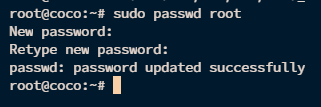

# How-to-Configure-SSH-for-Password-Authentication-Only-on-Ubuntu

Introduction
In today's cybersecurity landscape, securing remote access to servers is crucial. SSH (Secure Shell) provides a secure method for accessing servers, typically using public key authentication for enhanced security. However, in some cases, you may prefer to use password authentication instead of public keys. This guide walks you through configuring your SSH server to use password authentication exclusively and setting up a password for the root user, enhancing accessibility while maintaining security.

## Steps to Configure SSH for Password Authentication and Set Up Root Password

1. Edit the SSH Configuration File

    Open the SSH server configuration file:

    `sudo nano /etc/ssh/sshd_config`

2. Update Configuration

    Add or modify the following lines:

    `PasswordAuthentication yes`
    `ChallengeResponseAuthentication yes`
    `PubkeyAuthentication no`
    `PermitRootLogin yes`

    

- PasswordAuthentication yes: Enables password authentication.
- ChallengeResponseAuthentication yes: Enables challenge-response authentication.
- PubkeyAuthentication no: Disables public key authentication.
- PermitRootLogin yes: Allows root login.

3. Save the File

    Save the file and exit the text editor. In nano, press Ctrl+O, Enter then Ctrl+X.

4. Set Up Root Password

    If the root user does not have a password set or you wish to change it:

    ``sudo passwd root``

    Follow the prompts to set a new password for the root user and you need to enter the password twice also you can't see the password when you are typing it.
    
    

5. Restart the SSH Service

    Restart the SSH service to apply the new configuration:

``sudo systemctl restart ssh``

6. Connect Using SSH with Password Authentication

    Now, you should be able to connect using just the password:

    ``ssh root@<server-ip-address>``

    - When prompted, enter the root password.
    - You can also use a terminal like Termius.

### Additional Notes

- Ensure that the root account is not locked and that you know the root password.
- If you're using a different user, replace root with the appropriate username in the SSH command.

By following these steps, your SSH server will be configured to allow only password-based logins, enhance security by disabling public key authentication, and set a password for the root user.
